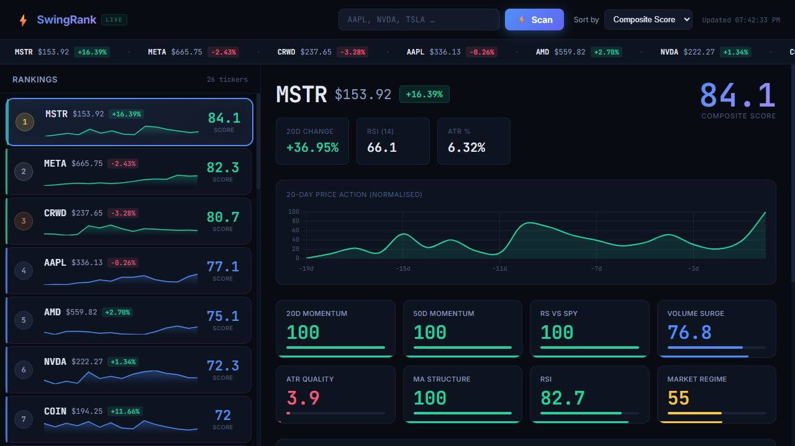

<h1 align="center">SwingRank</h1>

  A real-time swing trading scanner that ranks stocks and ETFs using a composite score built from 8 technical factors

  Rankings refresh every five minutes using the latest available daily market data, rather than a tick-by-tick price feed.

  <a href="https://swingrank-production-4d3e.up.railway.app/">Open SwingRank</a>

---

  Live Railway deployment, captured September 21, 2026. The hosted preview is an earlier release; the guide below describes this repository.

## What it does

SwingRank turns a watchlist into a ranked view of momentum, relative strength, volume and trend. Compare symbols, select one that interests you, and see which factors drive its score.

- Compare stocks and ETFs in one ranked list.
- Explore a normalized 20-session price chart and all eight factor scores.
- Check SPY market conditions and the trend, pullback and confirmation rules.

## Try a scan

1. Open the app to load the default watchlist of 26 symbols.
2. Enter your own symbols, separated by commas, and select Scan. For example: AAPL, NVDA, MSFT, TSLA.
3. Select a result to explore its chart and factor breakdown. Use Sort by to focus on a particular factor.

A custom scan accepts up to 100 entries. Repeated symbols count once in the results, and an empty field restores the default watchlist.

## Understand the score

The composite combines eight factor scores into a value from 0 to 100. A higher score means the symbol matches more of SwingRank's technical criteria. A score of 80 does not mean an 80% chance of profit.

See the eight factors and their weights

| Factor | Weight | What it looks at |
| --- | ---: | --- |
| 20D Momentum | 15% | Price change over 20 trading sessions. |
| 50D Momentum | 15% | Price change over 50 trading sessions. |
| RS vs SPY | 20% | 20-session performance compared with SPY. |
| Volume Surge | 10% | Latest volume versus the previous 20 sessions. |
| ATR Quality | 10% | Volatility as a share of price, with a scoring peak at 2.5%. |
| MA Structure | 15% | Alignment of price and short-term moving averages. |
| RSI | 10% | Momentum balance, with a scoring peak at RSI 55. |
| Market Regime | 5% | SPY's position relative to its 50-session average. |

## Read the signals

A symbol is trend qualified when it ranks in the scan's top 10, its price is above its 50-session average, that average is above its 200-session average, and both momentum readings are positive.

- Pullback active: the trend filter passes and the latest low reaches the 20-session average or below.
- Buy signal ready: the pullback conditions pass and the latest close exceeds the previous session's high.
- No trade signal: the trend filter does not pass.

Signals describe the app's rules, not trade execution. Since the top-10 condition depends on the watchlist, changing the symbols can change a signal.

## License

SwingRank is released under the [MIT License](LICENSE).
